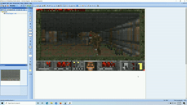

# Beedoom



[BeeUp](https://austria.omilab.org/psm/content/bee-up/info) is undeniably the greatest modelling tools ever created (don't even argue with me). The question we all had at one point, is whether this piece of brilliant software is capable of even more. The answer is yes! DLL Injection allows us to expand this godly work and make it display Doom! (You can't actually play it, since key bindings are not implemented.)

## How does it work and how to use it?

First of all install BeeUp if you haven't done that yet. Then make sure you don't have any diagrams saved, otherwise just delete all of them, after that create a new activity diagram. By utilising the **Notebook** component we can build our own canvas and represent anything we want, basically converting BeeUp into a display. This part of the project is called **Beetmap-Viewer** and consists of 84x48 **Notebooks** created manually in BeeUp. This can be done quite quickly with copy pasting already placed **Notebooks**. You just have to make sure to initially assemble the first row and then duplicate it until the desired height of the canvas has been reached.

The color values of these **Notebooks** must encode their position on the canvas. This is necessary, since we will use [Minhook](https://github.com/TsudaKageyu/minhook) to intercept the color retrieval method and replace it with a pixel rendered by Doom accordingly. Of course this can't be done by hand, therefore a small python script will help us out here:

```python
import json

width = 84
height = 48

with open("mods.sql", "w") as mods_sql:
    with open("Results.json", "r") as ids:
        json_ids = json.load(ids)
        for index, json_id in enumerate(json_ids):
            x = index % width
            y = index // width

            mods_sql.write("DELETE FROM [beeup16].[ADONIS].[instattr_string] WHERE instance = " + str(
                json_id["id"]) + " AND attribute = 10950\n")
            mods_sql.write(
                "INSERT INTO [beeup16].[ADONIS].[instattr_string] (attribute, instance, value) VALUES (10950, " + str(
                    json_id["id"]) + ", '$7b" + hex((1 << 7) | x)[2:].zfill(2) + hex((3 << 6) | y)[2:].zfill(
                    2) + "@')\n\n")
```

`Results.json` file can be obtained by downloading [Azure Data Studio](https://docs.microsoft.com/en-us/sql/azure-data-studio/download-azure-data-studio?view=sql-server-ver15). There you create a new connection with following configuration:

Server: `localhost,49747` <br>
Authentication type: `SQL Login` <br>
User name: `sa` <br>
Password: `12+*ADOxx*+34`

Once you have established a connection, execute the following SQL query:
```sql
SELECT [id] FROM [beeup16].[ADONIS].[instance] WHERE modelid = 12401
```
This will return all the instance ids of existing **Notebooks**. Export the results as a json file in the same location as the python script you have created with the content above. The script will yield a `mods.sql` file that should be executed in Azure Data Studio. Once this is done your **Notebooks** in BeeUp should all have the correct color encoding.

Now it's time to clone this repo:

```bash
$ git clone --recurse https://github.com/Grarak/beedom-beetmap-viewer.git
```

Copy all `.dll` files in the SDL2 directories (SDL2, SDL2_mixer, SDL_net) to the location of your BeeUp installation. Place your Doom WAD file also there! After that open the solution file in Visual Studio (this project was created with the 2022 edition) and hit compile. Inject the compiled `.dll` file into BeeUp with your favourite DLL Injector. Open the activity diagram created you have created just for this and select any **Notebook** with your mouse, afterwards move your cursor to a white area which is not covered with any **Notebooks**. Now constantly spam left clicks in order to force BeeUp to call the `deselect` method and repaint the whole scene. The injected `.dll` program will make BeeUp believe that all **Notebooks** are selected instead of just one, resulting in a redraw of all of them.
